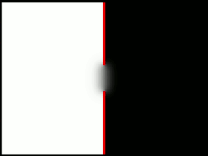

# Simple LBM using Cuda
This project is simple implementation of Lattice-Boltzman Method. The main purpose was 
to learn a little about parallel GPU programming. Program also uses GLUT which is unsupported for many years and does not use modern OpenGL functionality, but as I said the main purpose was to try out CUDA. 
### Built With
* CUDA
* OpenGL
* GLUT

### How to run - Windows

##### Prerequisites
* Visual Studio
* OpenGL
* CUDA
* GLUT library

Clone repo `git clone https://github.com/ptrk00/Simple-LBM-CUDA.git` 

Create `lib` and `lib/include/glut` folders at the project root directory. 
Place the GLUT's `.lib` file inside `lib` directory and GLUT's headers inside `lib/include/glut`.

Run cmake gui, select source code path and output path, click configure then click generate.

Open the generated `.sln` file. Right-click on the `LBM_CUDA` project and select `Set as Startup Project`.

Build the solution and then copy GLUT's `.dll` into the directory where your `.exe` is located.

Run the `.exe` file.

### Demo

### License
Distributed under the MIT License. See `LICENSE.md` for more information.